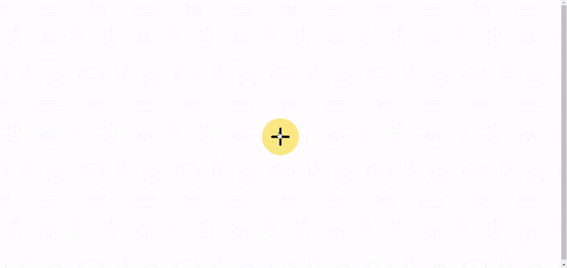
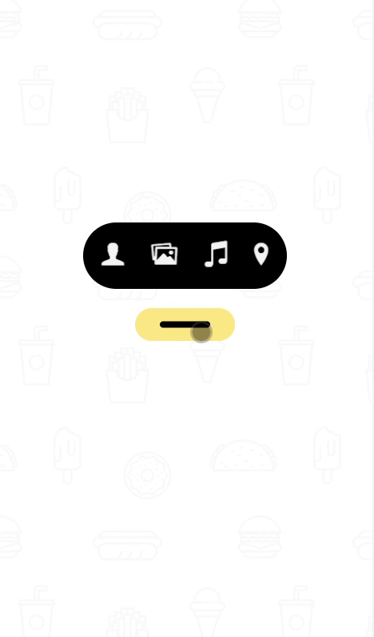
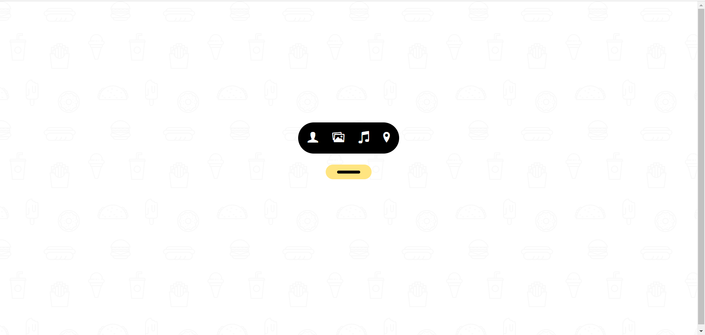
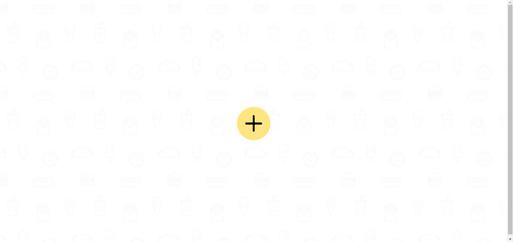

# Easily Add Movies, Music, and More – All with One Click!

<a href="https://www.linkedin.com/in/dharmendraverma95/" target="_blank">LinkedIn Profile </a>

<a href="https://www.behance.net/dhirukumar" target="_blank">Behance Profile </a>

# Overview

Easily Add Movies, Music, and More – All with One Click!" is an intuitive and user-friendly application designed to simplify the process of adding new content to your collection. With just one click, users can effortlessly add a variety of items such as movies, music, books, and other media to their personal libraries or platforms. Whether you're curating your digital collection, managing a media database, or organizing content for a project, this tool streamlines the process, saving time and effort.

### Features
<ul>
  <li>One-Click Additions: Quickly add new items (movies, music, books, etc.) with a simple click.
</li>
  <li>Customizable: Easily configure the types of content you want to add and how you want it displayed.</li>
  <li>Seamless Integration: Compatible with popular platforms and libraries, enabling smooth data entry.</li>
  <li>User-Friendly Interface: Simple, clean design making it easy for users of all technical levels to add new items.</li>
</ul>

# Preview

 
Desktop Icon Button Desgin & Animation 
 

 
 
Mobile Icon Button Desgin & Animation 
 

 

Icon Button Rest & Hover State
 

 
###### Lang
<ul>
  <li>Graphic Design Software: Photoshop, Figma (for mockups)</li>
  <li>Web Tools (Optional): HTML5, SCSS for any digital presentations or landing pages</li>
  <li>Font Awesome & Google Fonts  (Optional for icons )</li>

</ul>

